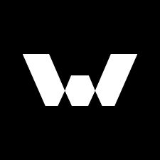

<p align="center">
  <a href="https://wildthunder.studio/" rel="noopener" target="_blank">
 </a>
</p>

<h3 align="center"><strong>digi-miners</strong>
</h3>

<div align="center">

[]()
[](/LICENSE)

</div>

---

## 📝 Table of Contents

- [About](#about)
- [Getting Started](#getting_started)
- [Deployment](#deployment)
- [Usage](#usage)
- [Built Using](#built_using)
- [Authors](#authors)

## 🧐 About <a name = "about"></a>

A website used to mint NFT of project Digi Miners

## 🏁 Getting Started <a name = "getting_started"></a>

<strong>Copy env.sample file to .env file</strong>

### Prerequisites

Install library dependencies

```
yarn
```

### Start

Development mode

```
yarn dev
```

Production mode

```
yarn build && yarn start
```

## 🎈 Usage <a name="usage"></a>

https://lorem.ipsum

## 🚀 Deployment <a name = "deployment"></a>

After merge the code into master branch, CI CD system will deploy on vercel

## ⛏️ Built Using <a name = "built_using"></a>

- [NextJs](https://nextjs.org/) - Web Framework

## ✍️ Authors <a name = "authors"></a>

- [@Wildthunder-studio](https://github.com/wildthunder-studio) - A world-class blockchain game & nft production house
